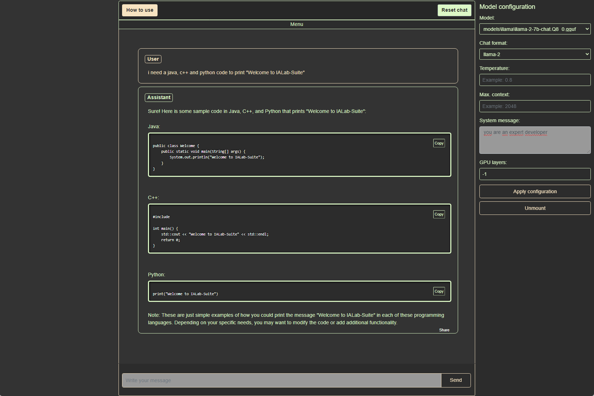
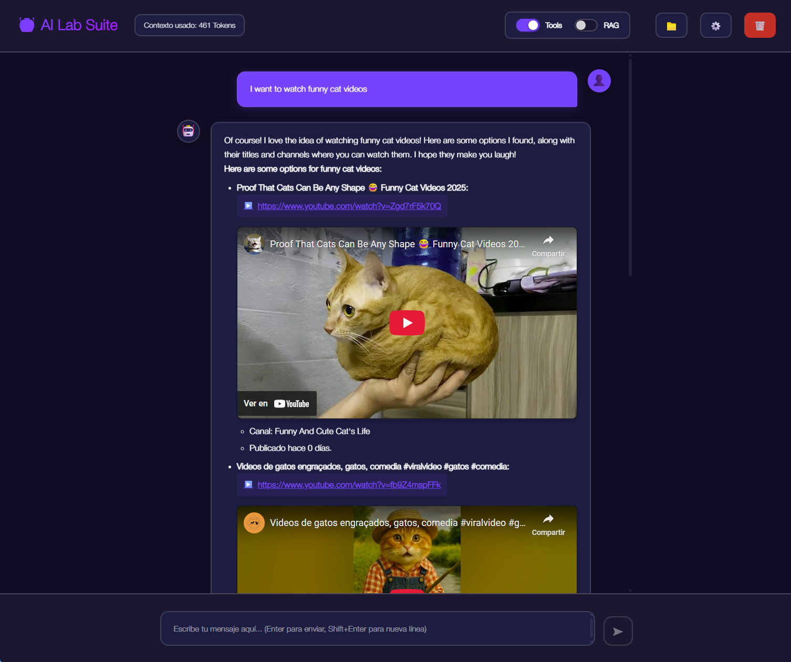

# 🤖 IALab-Suite

**A complete AI tools suite with React interface and Flask backend for testing Large Language Models (LLM) using llama.cpp**

[](https://opensource.org/licenses/MIT)
[](https://www.python.org/downloads/)
[](https://reactjs.org/)
[](https://flask.palletsprojects.com/)

### Responsive Inteface
<p align="center">
  
  
</p>
### Tool usage
#### You can develop your own tools for the model in a very simple and modular way.
<p align="center">
  
</p>

## 📋 Table of Contents

- [🚀 Features](#-features)
- [🏗️ Architecture](#-architecture)
- [📦 Installation](#-installation)
- [🔧 Configuration](#-configuration)
- [🎯 Usage](#-usage)
- [🛠️ Available Tools](#️-available-tools)
- [📂 Project Structure](#-project-structure)
- [🔄 API](#-api)
- [🧪 Development](#-development)
- [🤝 Contributing](#-contributing)
- [📄 License](#-license)

## 🚀 Features

### 🌟 Main Features
- **🔒 Total Privacy**: Works completely offline, without sending data to third parties
- **🎨 Modern Interface**: Responsive React frontend with modern design
- **🔌 Modular Architecture**: Auto-discoverable tool system with dynamic registration
- **⚡ Real Time**: Bidirectional communication with WebSockets
- **🧠 Multiple Models**: Support for any GGUF model
- **📚 Integrated RAG**: Retrieval Augmented Generation system included
- **🛠️ AI Tools**: Complete set of tools for the assistant with automatic discovery

### 🎯 Integrated Tools
- 🔍 **Internet Search**: Serper API integration
- 🔎 **Advanced Search**: Specialized searches with Google dorks
- 🎥 **Video Search**: YouTube API integration
- 💰 **Cryptocurrency Prices**: Real-time information
- 🖼️ **Image Generation**: AI image generation tool with Gradle API integration
- 🌐 **IP Information**: Geographic data retrieval


## 🏗️ Architecture

```
IALab-Suite/
├── 🖥️ Frontend-React/          # Modern user interface
├── 🔧 Backend-API/             # Flask API with WebSockets
├── 🛠️ tools/                  # Modular tools
└── 📁 chats/                  # Conversation storage
```

### 🔧 Main Components

- **🧠 Cortex**: AI-powered tool processing engine
- **🤖 Assistant**: Main AI assistant logic
- **🔍 RAG**: Retrieval Augmented Generation system
- **🌐 API React**: Flask server serving the React frontend
- **📡 SocketIO**: Real-time communication
- **🛠️ ToolRegistry**: Automatic tool discovery and registration system

## 📦 Installation

### 📋 Prerequisites

- **Python 3.8+**
- **Node.js 16+**
- **npm or yarn**
- **Git**

### 🛠️ Step-by-Step Installation

#### 1. 📥 Clone the Repository
```bash
git clone https://github.com/your-username/IALab-Suite.git
cd IALab-Suite
```

#### 2. 🐍 Set up Python Environment
```bash
# Create virtual environment
python -m venv venv

# Activate virtual environment
# Windows
venv\Scripts\activate
# macOS/Linux
source venv/bin/activate

# Install Python dependencies
pip install -r requirements.txt
```

#### 3. ⚙️ Install llama-cpp-python

**For CPU only:**
```bash
pip install --upgrade --quiet llama-cpp-python
```

**For GPU with CUDA:**
```bash
CMAKE_ARGS="-DGGML_CUDA=ON" FORCE_CMAKE=1 pip install --upgrade --force-reinstall llama-cpp-python --no-cache-dir
```


**For macOS with Metal (M1/M2/M3):**
```bash
CMAKE_ARGS="-DLLAMA_METAL=on" FORCE_CMAKE=1 pip install --upgrade --force-reinstall llama-cpp-python --no-cache-dir
```

#### 4. 🎨 Set up React Frontend
```bash
cd Frontend-React
npm install
npm run build
cd ..
```

#### 5. 🔑 Configure Environment Variables
```bash
# Create .env file in Backend-API/
cp Backend-API/.env.example Backend-API/.env

# Edit Backend-API/.env with your API keys
YOUTUBE_API_KEY=your_youtube_api_key
SERPER_API_KEY=your_serper_api_key
```

#### 6. 📁 Download Models
```bash
# Create models directory
mkdir -p Backend-API/models/llama

# Download example model (Llama 2 7B)
wget -O Backend-API/models/llama/llama-2-7b-chat.Q8_0.gguf \
  "https://huggingface.co/TheBloke/Llama-2-7B-Chat-GGUF/resolve/main/llama-2-7b-chat.Q8_0.gguf"
```

## 🔧 Configuration

### 🔑 Required API Keys

1. **YouTube API Key**:
   - Go to [Google Cloud Console](https://console.cloud.google.com/)
   - Create a project and enable YouTube Data API v3
   - Create an API key

2. **Serper API Key**:
   - Sign up at [Serper.dev](https://serper.dev/)
   - Get your free API key

### ⚙️ System Configuration

Edit `Backend-API/.env`:
```env
YOUTUBE_API_KEY=your_youtube_api_key_here
SERPER_API_KEY=your_serper_api_key_here
```

## 🎯 Usage

### 🚀 Start the Application

#### Option 1: Quick Start (Production Build) Not avaiable now.
```bash
# From the project root
python build_frontend.py 
```

#### Option 2: Development Mode
```bash
# Terminal 1: Start the backend server
cd Backend-API
python start_server.py

# Terminal 2: Start the React development server
cd Frontend-React
npm start
```

### 🌐 Access the Application

- **Development Mode**: Open your browser and go to: `http://localhost:3000` (React dev server)

### 💬 Use the Chat

1. **Select a model** from the dropdown menu
2. **Type your question** in the chat field
3. **Press Enter** or click send
4. **Watch the tools** execute in real-time
5. **Receive the complete response** with enriched information

## 🛠️ Available Tools

### 🔍 Internet Search
```python
# Example of automatic usage
"What's the weather in Madrid today?"
```

### 🎥 Video Search
```python
# The assistant will search for videos automatically
"Show me videos about Python programming"
```

### 💰 Cryptocurrency Prices
```python
# Query real-time prices
"What's the current price of Bitcoin and Ethereum?"
```

### 🖼️ Image Generation
```python
# Generate images with AI
"Generate an image of a space cat"
```

### 🌐 IP Information
```python
# Get geographic information
"Where is the IP 8.8.8.8 from?"
```

### 🔎 Advanced Search
```python
# Specialized searches
"Search for technical information about vulnerabilities"
```

## 📂 Project Structure

```
IALab-Suite/
├── 📁 Backend-API/
│   ├── 🧠 Cortex.py              # Tool processing engine
│   ├── 🤖 Assistant.py           # Main assistant logic
│   ├── 🔍 Rag.py                 # RAG system
│   ├── 🌐 Api_react.py           # Flask API for React
│   ├── 📡 SocketResponseHandler.py # WebSocket handling
│   ├── 🚀 start_server.py        # Main server
│   ├── 📁 tools/                 # Modular auto-discoverable tools
│   │   ├── 🛠️ base_tool.py       # Base tool interface
│   │   ├── 🔧 tool_registry.py   # Auto-discovery registry
│   │   ├── 🔍 search_tools.py    # Internet search
│   │   ├── 🎥 video_search_tool.py # Video search
│   │   ├── 💰 cripto_price.py     # Cryptocurrency prices
│   │   ├── 🖼️ generate_image.py   # Image generation
│   │   ├── 🌐 ip_info_tool.py     # IP information
│   │   └── 🔎 advanced_search.py  # Advanced search
│   ├── 📁 templates/             # HTML templates
│   ├── 📁 static/                # Static files
│   ├── 📁 models/                # LLM models
│   ├── 📁 documents/             # Documents for RAG
│   └── 📁 chats/                 # Conversation history
├── 📁 Frontend-React/
│   ├── 📁 src/
│   │   ├── 📱 App.js              # Main component
│   │   ├── 📁 components/         # React components
│   │   ├── 📁 context/            # State contexts
│   │   ├── 📁 hooks/              # Custom hooks
│   │   └── 📁 services/           # API services
│   ├── 📁 public/                # Public files
│   ├── 📁 build/                 # Production build
│   └── 📦 package.json           # Node.js dependencies
├── 📄 README.md                  # This file
├── 📄 requirements.txt           # Python dependencies
└── 📄 LICENSE                    # MIT License
```

## 🔄 API

### 📡 WebSocket Events

#### 📤 Client Events
- `message`: Send message to assistant
- `disconnect`: Disconnect from server

#### 📥 Server Events
- `response`: Assistant response (streaming)
- `console_output`: Console output (tools)
- `utilities_data`: Utilities data (videos, images)
- `finalization_signal`: Completion signal

### 🌐 REST Endpoints

#### 📊 System Information
```http
GET /api/system-info
```

#### 📁 Model Management
```http
GET /api/models
POST /api/load-model
```

#### 💬 Chat Management
```http
GET /api/chats
POST /api/save-chat
DELETE /api/delete-chat
```

## 🧪 Development

### 🔧 Frontend Development
```bash
cd Frontend-React
npm start
```
This will start the React development server at `http://localhost:3000`

### 🐍 Backend Development
```bash
cd Backend-API
python start_server.py
```
This will start the Flask API server at `http://localhost:8081`

### 🔄 Full Development Setup
For development, you'll need both servers running:
1. **Backend**: `http://localhost:8081` (Flask API)
2. **Frontend**: `http://localhost:3000` (React dev server)

The React development server will proxy API requests to the Flask backend automatically.

### 🛠️ Creating New Tools

The system now uses an **automatic tool discovery and registration system**. All tools inherit from `BaseTool` and are automatically discovered and registered.

#### 📋 Steps to Create a New Tool

1. **Create tool file** in `Backend-API/tools/my_new_tool.py`
2. **Inherit from BaseTool** and implement required methods
3. **The tool will be automatically discovered and registered** 🎉

#### 🔧 Tool Requirements

Every tool must:
- ✅ Inherit from `BaseTool`
- ✅ Implement `metadata` property
- ✅ Implement `get_tool_name()` class method
- ✅ Implement `execute()` method

### 📝 Tool Example

```python
# Backend-API/tools/my_new_tool.py
from .base_tool import BaseTool, ToolMetadata, ToolCategory

class MyNewTool(BaseTool):
    
    @property
    def metadata(self) -> ToolMetadata:
        return ToolMetadata(
            name="my_new_tool",
            description="Description of what my tool does",
            category=ToolCategory.UTILITY,  # SEARCH, FINANCE, IMAGE, UTILITY, MEDIA
            requires_api_key=False,  # Set to True if API key needed
            api_key_env_var="MY_API_KEY"  # Only if requires_api_key=True
        )
    
    @classmethod
    def get_tool_name(cls) -> str:
        return "my_new_tool"
    
    def execute(self, query: str, **kwargs):
        """
        Execute the tool with the given query
        
        Args:
            query (str): Input query from the user
            **kwargs: Additional parameters
            
        Returns:
            Any: Tool result (string, dict, tuple, etc.)
        """
        # Your tool logic here
        result = f"Processing: {query}"
        
        # You can return different types:
        # - String: Simple text result
        # - Dict: Structured data
        # - Tuple: (result, additional_data) for special handling
        
        return result
    
    def is_available(self) -> bool:
        """
        Check if the tool is available (has required API keys, etc.)
        
        Returns:
            bool: True if tool can be used
        """
        # Default implementation checks API key if required
        # Override if you need custom availability logic
        return super().is_available()
```

#### 🏷️ Available Categories

```python
from .base_tool import ToolCategory

# Available categories:
ToolCategory.SEARCH      # Search and information retrieval
ToolCategory.FINANCE     # Financial data and cryptocurrency
ToolCategory.IMAGE       # Image generation and processing
ToolCategory.UTILITY     # General utilities (IP info, etc.)
ToolCategory.MEDIA       # Video, audio, media search
```

#### 🔧 Advanced Tool Features

**For tools that need special result handling:**
```python
def execute(self, query: str, **kwargs):
    # For tools that return additional data (like video IDs)
    result_text = f"Found videos for: {query}"
    video_ids = ["abc123", "def456"]
    
    # Return tuple for special handling in Cortex
    return (result_text, video_ids)
```

**For tools with API key validation:**
```python
def is_available(self) -> bool:
    """Custom availability check"""
    api_key = os.getenv(self.metadata.api_key_env_var)
    if not api_key:
        return False
    
    # Additional validation logic
    return self._validate_api_key(api_key)
```

#### 🚀 Auto-Discovery

Once you create your tool file:

1. **Automatic Registration**: The `ToolRegistry` will automatically find and register your tool
2. **Immediate Availability**: Your tool becomes available to the AI assistant
3. **No Manual Configuration**: No need to modify `Cortex.py` or other files

#### 🧪 Testing Your Tool

```python
# Test your tool directly
from tools.my_new_tool import MyNewTool

tool = MyNewTool()
result = tool.execute("test query")
print(result)
```

#### 📊 Tool Registry Information

The system provides runtime information about all tools:

```python
from tools.tool_registry import ToolRegistry

registry = ToolRegistry.get_instance()

# List all registered tools
print("Available tools:", registry.list_tools())

# Get tool information
tool_info = registry.get_tool_info("my_new_tool")
print("Tool info:", tool_info)

# Execute tool through registry
result = registry.execute_tool("my_new_tool", "test query")
print("Execution result:", result.data if result.success else result.error)
```

## 🤝 Contributing

Contributions are welcome! 🎉

### 📋 How to Contribute

1. **🍴 Fork** the project
2. **🌿 Create a branch** for your feature: `git checkout -b feature/AmazingFeature`
3. **💾 Commit** your changes: `git commit -m 'Add some AmazingFeature'`
4. **📤 Push** to the branch: `git push origin feature/AmazingFeature`
5. **🔄 Open a Pull Request**

### 🐛 Report Bugs

Open an [issue](https://github.com/your-username/IALab-Suite/issues) describing:
- 📝 Bug description
- 🔄 Steps to reproduce
- 📱 Environment (OS, Python version, etc.)
- 📸 Screenshots if relevant

### 💡 Request Features

Open an [issue](https://github.com/your-username/IALab-Suite/issues) with:
- 📝 Detailed description
- 🎯 Use cases
- 📊 Expected benefits

## 📊 System Information

### 🧪 Tested on:
- **💻 macOS**: MacBook Pro M3-Pro (11 CPU cores, 14 GPU cores, 18GB RAM)
- **🐧 Linux**: AMD Ryzen 5600X, NVIDIA RTX 3060 (12GB VRAM, 32GB RAM)
- **🪟 Windows**: Various configurations

### 🐍 Compatible Versions:
- **Python**: 3.8 - 3.12
- **Node.js**: 16+
- **React**: 18.2+
- **Flask**: 2.0+

## 🔗 Useful Links

- 📚 [llama.cpp Documentation](https://github.com/ggerganov/llama.cpp)
- 🤗 [GGUF Models on Hugging Face](https://huggingface.co/models?search=gguf)
- 🎥 [YouTube Data API](https://developers.google.com/youtube/v3)
- 🔍 [Serper API](https://serper.dev/)

## 💖 Support the Project

If this project has been useful to you, consider:

- ⭐ Giving the repository a star
- 🐛 Reporting bugs or improvements
- 💝 Contributing with code
- ☕ Buy me a coffee: [](https://www.paypal.me/borjaoteroferreira)

## 📄 License

This project is licensed under the MIT License - see the [LICENSE](LICENSE) file for more details.

---

<div align="center">

**🤖 Made with ❤️ for the AI community**

**⭐ If you like this project, give it a star! ⭐**

</div>
