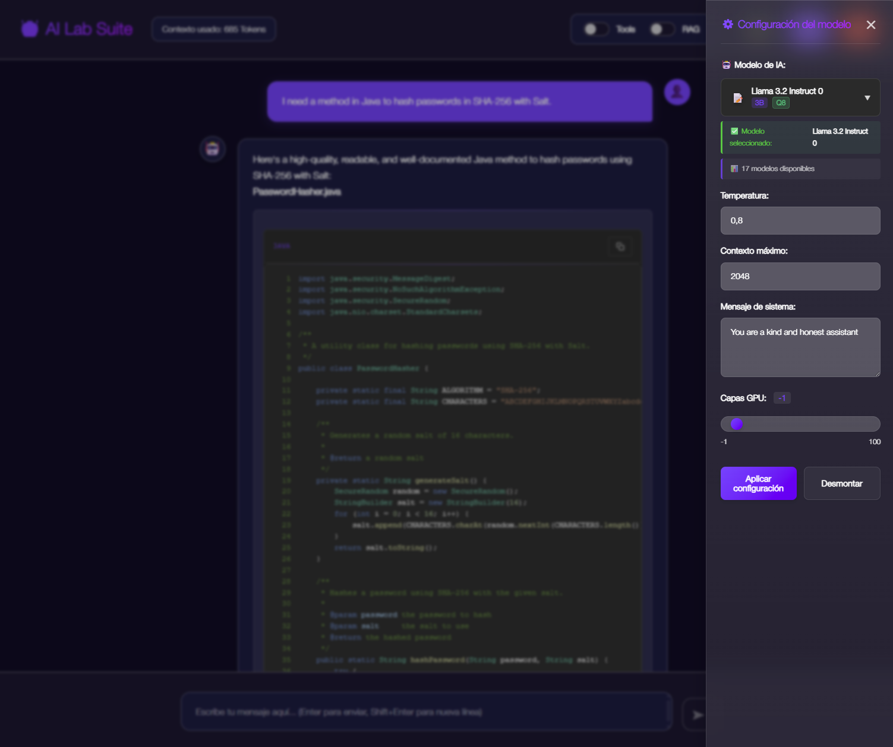

# IALab-Suite 

### Flask API Rest for Testing LLM Models with Llama.cpp Library. Try large language models without code.

This Flask application offers a unique local chat experience for testing Large Language Model (LLM) using the Llama.cpp library. Unlike many online platforms, this chat operates entirely offline, ensuring user privacy by eliminating the need for internet access and avoiding data sharing with third-party companies. Users can confidently mount and evaluate LLM models in the GGUF format without compromising their data security. 
The app is under active development, with a focus on enhancing features and maintaining robust privacy measures.

For production environments use another wsgi server.<br>

### Responsive Inteface
<p align="center">
  
</p>

### Desktop Interface
<p align="center">
  
</p>

## Dependencies

- Flask
- flask_socketio
- CORS
- llama-cpp-python

```bash
pip install Flask flask-socketio flask-cors 

```

Or in the proyect folder 

```bash
pip install -r requirements.txt
```

## llama-cpp-python installation

There are different options for installing the llama-cpp package:

- CPU Usage
- CPU + GPU (using one of the many BLAS backends)
- Metal GPU (MacOS with Apple Silicon chip)

### Installation CPU Only (Any processor compatible with AVX2)

```bash
pip install --upgrade --quiet llama-cpp-python
```

### Installation with OpenBLAS / cuBLAS / CLBlast

llama.cpp supports multiple BLAS backends for faster processing. Use the FORCE_CMAKE=1 environment variable to force the use of cmake and install the pip package for the desired BLAS backend.

Example installation with cuBLAS backend:

```bash
CMAKE_ARGS="-DLLAMA_CUBLAS=on" FORCE_CMAKE=1 pip install llama-cpp-python
```

**IMPORTANT:** If you have already installed the CPU-only version of the package, you must reinstall it from scratch. Consider the following command:

```bash
CMAKE_ARGS="-DLLAMA_CUBLAS=on" FORCE_CMAKE=1 pip install --upgrade --force-reinstall llama-cpp-python --no-cache-dir
```

### Installation with Metal on MacOS (M1/M2/M3) 

llama.cpp supports Apple Silicon as a first-class citizen, optimized through ARM NEON, Accelerate, and Metal frameworks. Use the FORCE_CMAKE=1 environment variable to force the use of cmake and install the pip package for Metal support.

Open a terminal and check these examples.

Example installation with Metal support:

```bash
CMAKE_ARGS="-DLLAMA_METAL=on" FORCE_CMAKE=1 pip install llama-cpp-python
```

**IMPORTANT:** If you have already installed a CPU-only version of the package, you must reinstall it from scratch: consider the following command:

```bash
CMAKE_ARGS="-DLLAMA_METAL=on" FORCE_CMAKE=1 pip install --upgrade --force-reinstall llama-cpp-python --no-cache-dir
```

### Installation with CUDA on Linux 

```bash
export CXX=$(which g++) 
```

```bash
export CUDA_PATH=/usr/local/cuda 
```

```bash
CMAKE_ARGS="-DLLAMA_CUBLAS=on" pip install llama-cpp-python --upgrade --force-reinstall --no-cache-dir
```

If you get an error for not finding the cuda architecture, you can try this command:

```bash
CUDA_ARCH=sm_86 CMAKE_ARGS="-DLLAMA_CUBLAS=on" pip install llama-cpp-python --upgrade --force-reinstall --no-cache-dir
```

In my case the architecture of the card is ampere so it corresponds to sm_86, change it to the one that corresponds to your graphics card


### Installation on Windows

If you want to install llama-cpp-python by compiling it from the source, you can follow most of the instructions in the repository itself. However, there are some specific instructions for Windows that might be helpful.

#### Requirements to install llama-cpp-python

- git
- python
- cmake
- Visual Studio Community / Enterprise (ensure you install this with the following setup)
  - Desktop development with C++
  - Python development
  - Embedded Linux development with C++

- Download and install CUDA Toolkit 12.3 from the [official Nvidia website](https://developer.nvidia.com/cuda-12-3-0-download-archive?target_os=Windows).

  Verify the installation with `nvcc --version` and `nvidia-smi`.

  Copy the files from: 
  ```
  C:\Program Files\NVIDIA GPU Computing Toolkit\CUDA\v12.\extras\visual_studio_integration\MSBuildExtensions
  ```
  To the folder:
  
  For Enterprise version:
  ```
  C:\Program Files\Microsoft Visual Studio\2022\Enterprise\MSBuild\Microsoft\VC\v170\BuildCustomizations
  ```
  For Community version:
  ```
  C:\Program Files\Microsoft Visual Studio\2022\Community\MSBuild\Microsoft\VC\v170\BuildCustomizations
  ```

Clone the git repository recursively to also get the llama.cpp submodule.

```bash
git clone --recursive -j8 https://github.com/abetlen/llama-cpp-python.git
```

Open a command prompt and set the following environment variables.

```bash
set FORCE_CMAKE=1
set CMAKE_ARGS=-DLLAMA_CUBLAS=OFF
```

If you have an NVIDIA GPU, make sure DLLAMA_CUBLAS is set to ON.

#### Compilation and Installation

Now you can navigate to the llama-cpp-python directory and install the package.

```bash
python3 -m pip install -e .
```

**IMPORTANT:** If you have already installed a CPU-only version of the package, you must reinstall it from scratch: consider the following command:

```bash
python3 -m pip install -e . --force-reinstall --no-cache-dir
```

## **IMPORTANT (Mac / Linux / Windows):**
After installation:

Go to the llama-cpp installation folder

If you don't know where the directory is located, you can always do a quick search for the file llama_chat_format.py

Rename the file llama_chat_format.py to llama_chat_format.bk and paste the attached file into this repository.

This solution is provisional but necessary to be able to use models like Mixtral and others that need templates that are not included by default in the llama-cpp library. In the future I will implement a template editor to create, load and save templates without having to replace library files.

## Usage

Download the [model](https://huggingface.co/TheBloke/Llama-2-7B-Chat-GGUF/resolve/main/llama-2-7b-chat.Q8_0.gguf?download=true) and place it in the models/llama folder.
The path looks like this:

```bash
models/llama/llama-2-7b-chat.Q8_0.gguf
```

This model is used as the default model, (dont need llama_chat_format.py file sustitution).


You can add more models in .gguf format on [Hugging Face](https://huggingface.co/models?search=gguf) and they will be added directly to the list in the interface.


[TheBloke/mixtral_7bx2_moe](https://huggingface.co/TheBloke/Mixtral_7Bx2_MoE-GGUF/resolve/main/mixtral_7bx2_moe.Q5_0.gguf)[ Size - 8.87 GB | Max ram required - 	11.37 GB ] (need llama_chat_format.py sustitution and use Custom-IALab chat format)


The path looks like this:
```bash
models/TheBloke/mixtral_7bx2_moe/mixtral_7bx2_moe.Q5_0.gguf
```

**IMPORTANT:** Remember to use models of size according to the available RAM of your graphics card.
In the case of MacOs with Metal, the maximum memory that can be used for inference is limited, around 65-75% of the total memory.
For use with CPU the limit is the total memory of the CPU on both Windows and Mac.

Run the App:

```bash
python app.py
```

[](paypal.me/BorjaOteroFerreira)


#### __Tested in MacBook-Pro M3-Pro 11 cpu cores , 14 gpu cores, 18 unify memory (Sonoma 14.1) & AMD Ryzen 5600x, Nvidia RTX 3060 gaming OC 12GB, 32GB cpu Memory (Linux/Windows). Tested with 12gb max size models__ | __Python version 3.11.7__ | 

## Code & license 
This code released under the [MIT License](https://github.com/BorjaOteroFerreira/IALab-Suite/blob/main/LICENSE)

